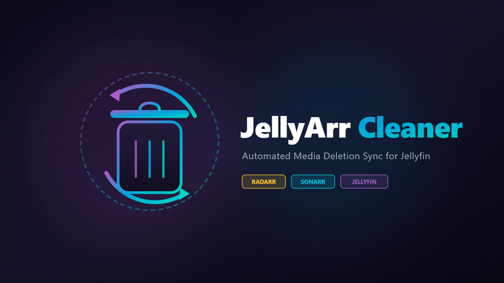

<p align="center">
  
</p>

<h1 align="center">JellyArr Cleaner</h1>

<p align="center">
  <strong>Automatically synchronize movie and series deletions in Jellyfin with Radarr and Sonarr.</strong>
</p>

<p align="center">
  <a href="LICENSE"></a>
  
  
</p>

---

## Overview

**JellyArr Cleaner** is a Jellyfin server plugin designed to bridge the gap between media consumption and library management. When you delete a movie or television series from Jellyfin, JellyArr Cleaner immediately notifies **Radarr** or **Sonarr** to handle the corresponding media files and records.

This prevents the common frustration where deleted media gets automatically re-downloaded by your *arr applications due to remaining monitored.

---

## Functionality & Features

- **Real-Time Event Hooking**: Intercepts Jellyfin's internal library deletion events (`ILibraryManager.ItemRemoved`) instantaneously without requiring polling or external webhooks.
- **Accurate Metadata Provider Matching**:
  - **Movies (Radarr)**: Matches media via TMDb ID (`MetadataProvider.Tmdb`).
  - **Series (Sonarr)**: Matches series via TVDb ID (`MetadataProvider.Tvdb`).
- **Flexible Deletion Actions**:
  - **Delete File(s) Only & Unmonitor**:
    - Deletes the media files from disk via the respective *arr API.
    - Automatically marks the movie or series as **unmonitored** to prevent automatic re-downloading while preserving history and metadata in Radarr/Sonarr.
  - **Delete & Remove**:
    - Completely removes the movie or entire series entry from Radarr or Sonarr along with the files on disk.
- **Integrated Web Dashboard**: Full settings UI embedded natively into the Jellyfin Server Dashboard for quick configuration.

---

## Supported Versions

| Jellyfin Version | Plugin Target ABI | Target Framework | Support Status | Minimum Plugin Version |
| :--- | :--- | :--- | :--- | :--- |
| **Jellyfin 12.x** | `12.0.0.0` | `.NET 10.0` (`net10.0`) | **Supported** (Active) | Current (`main`) |
| **Jellyfin 10.11.x** | `10.11.0.0` | `.NET 9.0` (`net9.0`) | **Supported** | `v0.0.1.0` |

> [!NOTE]
> Jellyfin 12 migrated the server runtime to .NET 10. Jellyfin's plugin repository automatically resolves the build matching your server's `targetAbi`.

---

## Installation

### Method 1: Via Jellyfin Plugin Repository (Recommended)

1. Open your Jellyfin Web Interface and log in as an administrator.
2. Navigate to **Dashboard** &rarr; **Plugins** &rarr; **Repositories**.
3. Click the **+** button to add a repository:
   - **Repository Name**: `JellyArr Cleaner`
   - **Repository URL**:
     ```text
     https://raw.githubusercontent.com/pradumnk-mahanta/jellyarr-cleaner/main/manifest.json
     ```
4. Save the repository, then navigate to the **Catalog** tab under **Plugins**.
5. Locate **JellyArr Cleaner**, select it, and click **Install**.
6. Restart your Jellyfin server to complete the installation.

### Method 2: Manual Installation

1. Go to the [Releases](https://github.com/pradumnk-mahanta/jellyarr-cleaner/releases) page and download `JellyArrCleaner.zip` matching your Jellyfin version.
2. Stop your Jellyfin server.
3. Extract the contents into your Jellyfin `plugins/JellyArrCleaner` directory:
   - **Linux**: `/var/lib/jellyfin/plugins/JellyArrCleaner/`
   - **Windows**: `%ProgramData%\Jellyfin\Server\plugins\JellyArrCleaner\`
   - **Docker**: `<path-to-config>/plugins/JellyArrCleaner/`
4. Start your Jellyfin server.

---

## Configuration

Once installed and the server has restarted:

1. In the Jellyfin Dashboard, go to **Plugins** &rarr; **JellyArr Cleaner**.
2. Configure your connection details:

### Radarr Settings (Movies)
- **Radarr Base URL**: The URL where Radarr is accessible (e.g., `http://localhost:7878` or `http://radarr:7878`).
- **Radarr API Key**: Your Radarr API key (found under *Settings &rarr; General &rarr; Security* in Radarr).
- **Movie Deletion Action**:
  - `Delete Movie File Only`: Removes the movie file from disk and unmonitors the movie in Radarr.
  - `Delete & Remove Movie`: Completely purges the movie entry from Radarr.

### Sonarr Settings (Series)
- **Sonarr Base URL**: The URL where Sonarr is accessible (e.g., `http://localhost:8989` or `http://sonarr:8989`).
- **Sonarr API Key**: Your Sonarr API key (found under *Settings &rarr; General &rarr; Security* in Sonarr).
- **Series Deletion Action**:
  - `Delete Files Only`: Removes all episode files from disk and unmonitors the series in Sonarr.
  - `Delete & Remove Show`: Completely purges the series entry from Sonarr.

3. Click **Save**.

---

## Building from Source

### Prerequisites
- [.NET 10.0 SDK](https://dotnet.microsoft.com/download/dotnet/10.0) or newer

### Build Steps

```bash
# Clone the repository
git clone https://github.com/pradumnk-mahanta/jellyarr-cleaner.git
cd jellyarr-cleaner

# Build the plugin in Release mode
dotnet build Jellyfin.Plugin.JellyArrCleaner.csproj -c Release
```

The compiled binaries will be output to:
```text
bin/Release/net10.0/Jellyfin.Plugin.JellyArrCleaner.dll
```

---

## License

This project is licensed under the terms of the [GNU General Public License v3.0](LICENSE).
